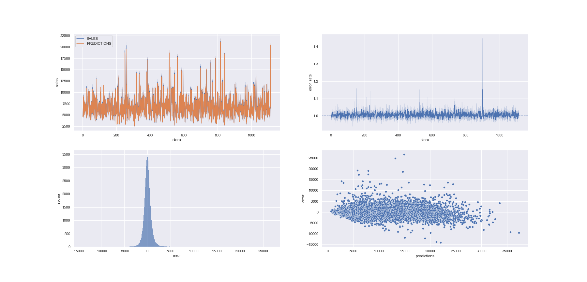

# Predição de vendas das lojas da Rossmann

 Author : Ricardo Barbosa de Almeida Campos 

## Introdução

Este é um projeto de ciência de dados que tem como objeto criar um modelo de aprendizagem de máquina, que seja capaz de prever os valores das vendas das lojas da Rossmann com um nível de incerteza aceitável.

## Problema de negócio

A empresa Rossmann gerencia mais de 3000 farmácias em 7 países da europa. Atualmente, foi dado aos gerentes da Rossmann que realizassem a previsão de vendas para as próximas 6 semanas. As vendas são influenciadas por diversos fatores , como descontos, concorrentes, feriados, sasonalidade etc. Tornando a tarefa de realizar a previsão bastante complicada. Então esse estudo foi realizado com o objetivo de ajudar nesta tarefa de prever as vendas.

### Causa Raiz

A previsão dos dados foi requisitados aos gerentes pelo fato dos diretores quererem realizar reformas nas lojas de acordo com a previsão de vendas, assim realocando melhor os recursos.

## Dataset

O dataset utilizado para treinar os modelos e realizar as predições foi retirado da página web do link :<a href = "https://www.kaggle.com/c/rossmann-store-sales"> Dataset de vendas da Rossmann</a>

Uma descrição de cada variável presente neste dataset pode ser encontrada na página.

## Desenvolvimento

 O desenvolvimento de estudo seguiu diversos passos que compoem um estudo consisten na área de Ciência de Dados, que foram os seguintes:
<ul>
  <li> Importação e limpeza dos dados</li>
  <li> Feature Engineering </li>
  <li> EDA</li>
  <li> Preparação dos dados</li>
  <li> Seleção de atributos </li>
  <li> Treinamento dos modelos</li>
  <li> Ajuste fino dos hiper parâmetros</li>
  <li> Resultados de Negócio </li>
</ul>
 Algumns passos não serão detalhados neste documento, mas podem analisados no notebook 'colocar nome do notebook'.

### Seleção de atributos

 A seleção de atributos foram utilizados dois algoritmos para escolher quais variáveis seriam utilizadas para treinar os modelos de aprendizagem de máquina. O primeiro algoritmo foi o Boruta e o segundo foi o MRMR (Maximum Relevance — Minimum Redundancy). Para determinar o algoritmo que será utilizado, mais adiante no projeto serão comparados o erros dos modelos gerados.

#### Boruta

 É um algoritmo de seleção automática de colunas dentro de um dataset que possuem algum tipo de impacto na variável alvo da predição. Vem como uma alternativa a simplesmente treinar uma algoritmo de Random Forest e selecionar as variáveis acima de valor limítrofe de importância.
Duas características permitem que o Boruta possa realizar a seeleção de forma automática, as "Shadow Features" que são cópias dos conjuntos de dados original, mas "desorganizado", e a utilização da distribuição binomial para decidir se uma variável deve ser incluída na seleção final. O artigo do Towards Data Science melhor como funciona o Boruta - <a href = "https://towardsdatascience.com/boruta-explained-the-way-i-wish-someone-explained-it-to-me-4489d70e154a">Boruta TDS</a>

#### MRMR (Maximum Relevance — Minimum Redundancy)

MRMR é um algoritmo, que diferente do Boruta que seleciona as características que tem impacto na variável alvo da predição, este seleciona as 'n' variáveis mais importantes para predição.
O algoritmo de forma iterativa e a cada iteração seleciona a informação com máxima relevâcnia e menor redundância dentro as variáveis.
Bastate utilizado quando se possui um conjunto de dados bem grande e há algum tipo de limitação, seja computacional ou de tempo, que fará com que não se possa usar todo o dataset.
Para mais informação como este modelo funciona, este artigo do Towards Data Science explica bem - <a href = "https://towardsdatascience.com/mrmr-explained-exactly-how-you-wished-someone-explained-to-you-9cf4ed27458b">MRMR TDS</a>

### Modelos de Aprendizagem de Máquina

 Os modelos selecionados como candidatos a possíveis preditores são o seguinte:
<ul>
  <li> Linear Regression</li>
  <li> Linear Regression - Lasso </li>
  <li> Random Forest</li>
  <li> XGBoost</li>
</ul>

Não é pertinente deste projeto entrar em detalhes de como cada algoritmo funciona.

Os modelos serão treinados com os dados selecionados pelo Boruta e o MRMR, para verificar qual possui a melhor performance. O melhor modelo será selecionado de acordo com o RMSE e o tamanho do arquivo do modelo, que será gerado utilizando a biblioteca Pickle. 

#### Performance dos modelos utilizando o Boruta

| Nome do Modelo      |  MAE    | MAPE | RMSE    |
|:-------------------:|:-------:|:----:|:-------:|
| Regressão Linear    | 1966,81 | 0,31 | 2824,65 |
| Reg. Linear - Lasso | 1991,63 | 0,31 | 2871,34 |
| Random Forest       | 588,79  | 0,09 | 933,71  |
| XGBoost             | 822,30  | 0,12 | 1196,85 |

#### Performance dos modelos utilizando o MRMR

| Nome do Modelo      |  MAE    | MAPE | RMSE    |
|:-------------------:|:-------:|:----:|:-------:|
| Regressão Linear    | 1998,47 | 0,31 | 2876,59 |
| Reg. Linear - Lasso | 2007,33 | 0,31 | 2896,56 |
| Random Forest       | 1111,28 | 0,17 | 1598,83 |
| XGBoost             | 1183,50 | 0,18 | 1723,41 |

 De acordo com os valores das tabelas, os modelos recomendados seriam o Random Forest e o XGBoost com as variáveis selecionadas pelo Boruta.Mas o Random Forest quando salvo, gerou um modelo com o tamanho na casa das centenas de MB e o XGBoost gerou na casa das dezenas de MB. O tamanho do arquivo gerado é importante para a aplicação WEB que será gerada.

### Ajuste fino dos hiper parâmetros

 O ajuste fino dos hiper parâmetros será realizado utilizando a otimização Bayesiana. Esta técnica de otimização vem do teorema de Bayes, na qual é possível determinar a probabilidade de um evento acontecer dada uma condição e baseando em uma informação prévia.
Para uma explicação mais detalhada ler este artigo - <a href = "https://distill.pub/2020/bayesian-optimization/"> Bayesian Optimization</a>

Como o modelo de aprendizagem de máquina escolhido no parágrafo anterior foi XGBoost, o mesmo terá os parâmetros ajustados pela otimização Bayesiana. A tabela desta seção apresenta os resultados de error para o modelo.

| Nome do Modelo      |  MAE    | MAPE | RMSE    |
|:-------------------:|:-------:|:----:|:-------:|
| XGBoost - Ajustado  | 578,40  | 0,08 | 858,78  |

## Insights de negócio

Nesta seção serão apresentados alguns insights de negócio que foram descobertos durante a exploração dos dados.

<ul>

  <li> Lojas com maior sortimentos deveriam vender mais - FALSO </li>
  <li> Lojas com competidores mais próximos deveriam vender menos - FALSO </li>
  <li> Lojas com promoções por mais tempo deveriam vender mais - FALSO</li>
  <li> Lojas abertas durante o feriado de Natal deveriam vender mais - FALSO</li>
  <li> Lojas deveriam vender mais no final do ano - FALSO</li>
  <li> Lojas deveriam vender mais depois do dia 10 de cada mês - VERDADEIRO</li>
  <li> Lojas deveriam vender menos aos finais de semana - VERDADEIRO</li>
</ul>

## Resultados

### Performance do modelos

Primeiro será debatido a performance do modelo para as predições.
Na primeira figura temos as varições de MAPE para cada loja dentro do dataset. Percebe-se que o valor máximo de MAPE sendo próximo dos 22,5% e o média está em torno de 7,5% para os modelos.  

 Na segunda imagem tem-se uma combinação de 4 imagens. A primeira é uma comparação dos valores de venda para o dataset de teste e o os valores gerados pelo modelo XGBoos. Na segunda figura tem-se a taxa de rro. Na terceira a distribuição dos erros e na quarta um gráfico de pontos para os valores absolutos de erro em relação as lojas.

### Resultados de Negócio

  
Agora serão analisados os resultados de negócio com valores monetários. De acordo com a tabela abaixo, o modelo foi capaz de prever que o valor somado de vendas para todas as lojas com, levando em consideração a variação do MAPE.
  

  | **Cenário**     | **Valor Predição (R$)** |
  |:---------------:|:-----------------------:|
  | Predição        | 936.071.580,89          |
  | Predição - MAPE | 935.225.007,35          |
  | Predição + MAPE | 936.918.154,43          |

  
Um dos pontos mais importantes do projeto seria a capacidade de prever o valor gerado por cada loja, para que os gerentes possam planejar as reformas da melhor maneira possível.
  Na tabela abaixo há uma demonstração dos valores para as lojas até 10, que estam presentes no dataset.
  

| **Loja**        | **Valor Predição (R$)** |
|:---------------:|:-----------------------:|
| 1               | 183.831,97              |
| 3               | 264.979,76              |
| 7               | 283.135,59              |
| 8               | 230.571,40              |
| 9               | 299.926,65              |
| 10              | 227.134,88              |

## Próximos Passos

  
 Uma aplicação web simples foi montada de forma que requisições provenientes de um script Python possam ser utilizadas como forma de realizar a predição. Mas para uma aplicação futura, seria bom desenvolver uma interface web  para tornar o processo de requisição mais amigável.
  

  
 Um outro ponto a ser enfrentado em um próximo desenvolvimento, seria a realização do processo de cross validation para todos os modelos.
  

